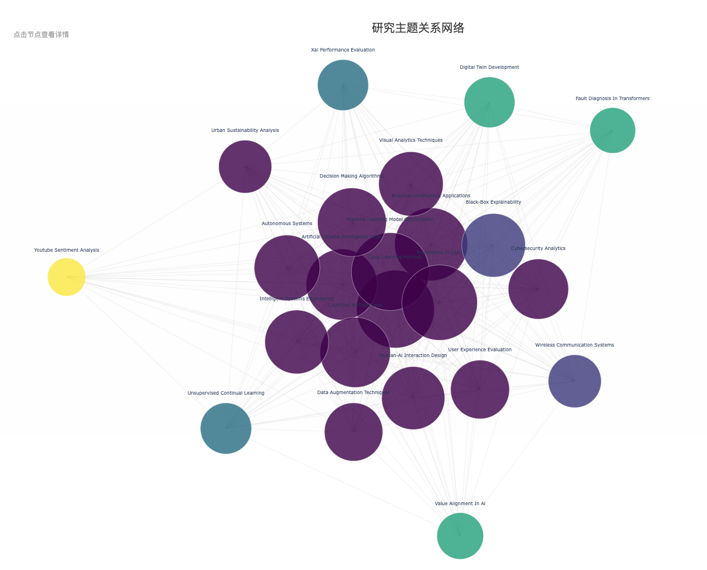
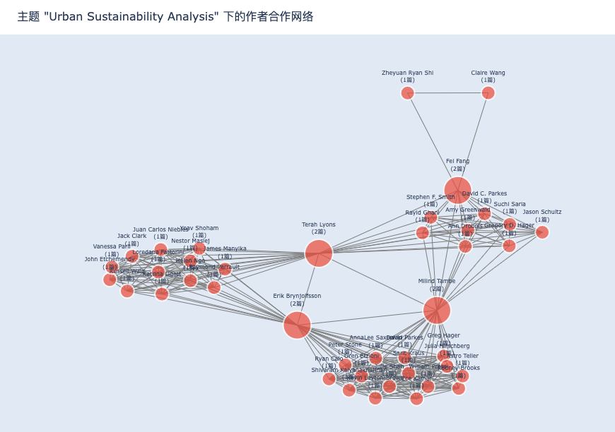
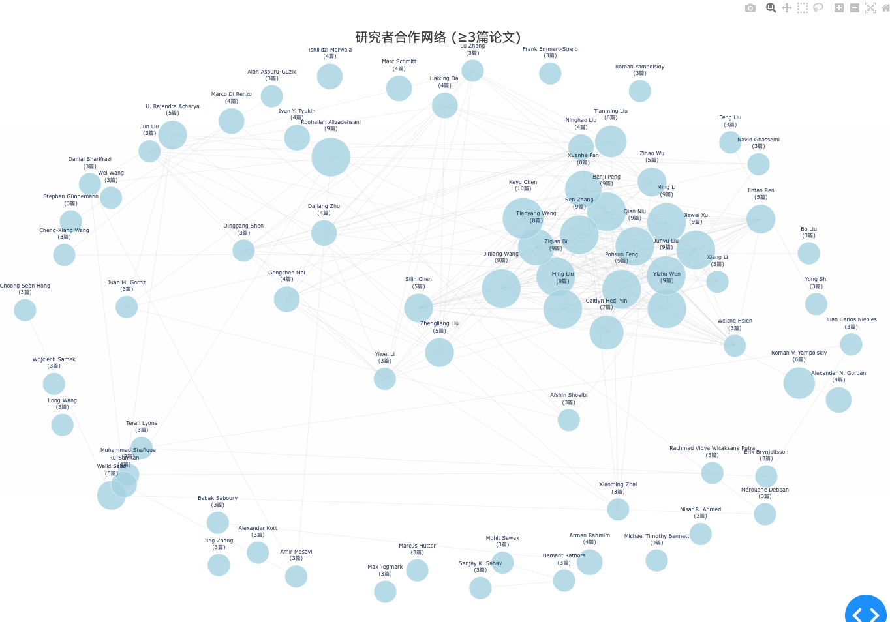
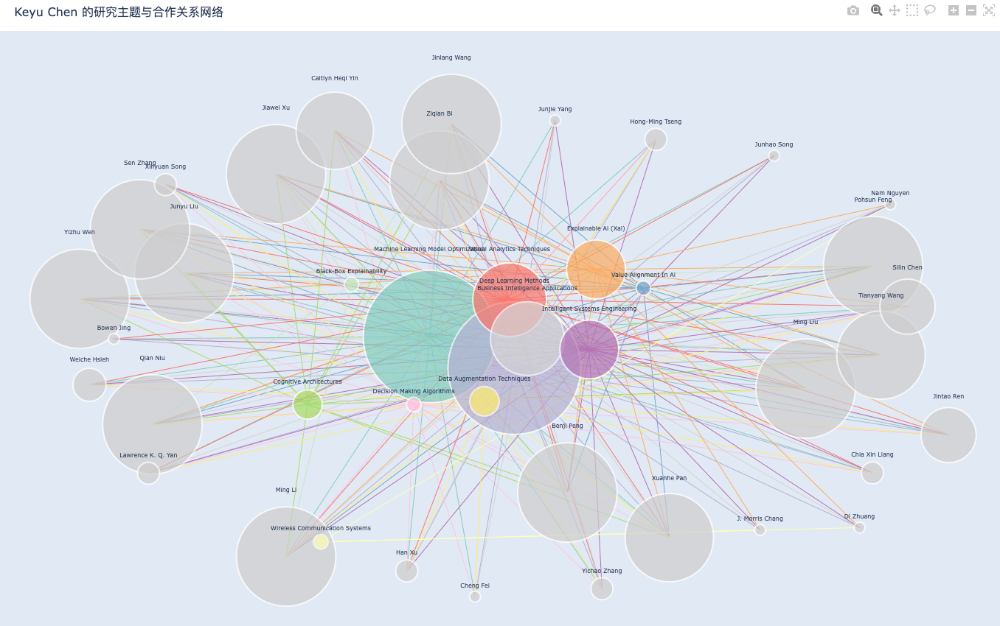

# CoauthorWeb

## 项目简介
本项目是一个本地化coauthor network和topic network的可视化工具。
该项目基于你本地papers_db.json文件，生成coauthor network和topic network。
本项目文件夹中的papers_db.json是一个示例文件，你可以使用自己的papers_db.json文件替换。
papers_db.json文件可以使用我的另外一个项目PaperGuru生成。

 

## 功能特点

该工具提供两种网络分析视图：

1. **主题网络分析**
   - 显示研究主题之间的关系
   - 可视化主题的关联强度
   - 点击主题节点可查看该主题下的作者合作网络

2. **研究者网络分析**
   - 展示研究者之间的合作关系
   - 显示作者的论文数量和研究主题
   - 点击作者节点可查看该作者的主题分布
   - 支持论文数量门槛值过滤

## 注意事项

0. 首先需要安装Ollama，请参考[Ollama安装教程](https://ollama.com/docs/installation)
1. 需要安装Llama3.2：2b模型，请参考[Llama3.2：2b模型安装教程](https://ollama.com/docs/models/llama3.2)   
2. 首次运行前必须先执行 `llama_topic_processor.py` 生成论文主题的embedding文件和主题的聚类分析
3. 确保系统中安装了所有必需的依赖包 
4. 运行 python main.py 启动界面
5. 选择模型运行后，会提示127.0.0.1:8050，请在浏览器中访问该地址以使用软件
6. 运行时如遇到端口占用问题，请关闭相关的浏览器标签页或重启终端
7. 建议使用现代浏览器（Chrome、Firefox等）访问可视化界面

## 安装要求

1. Python 3.7+
2. 依赖包：
   pip install -r requirements.txt

#### 若在运行时显示端口被占用，请使用如下命令关掉端口：
1. 在 Mac/Linux 上
lsof -ti:8050 | xargs kill -9

2. 或者在 Windows 上
netstat -ano | findstr :8050
taskkill /PID <找到的PID> /F

#### 本软件采用GNU GPLv3许可证，严格限制商用。